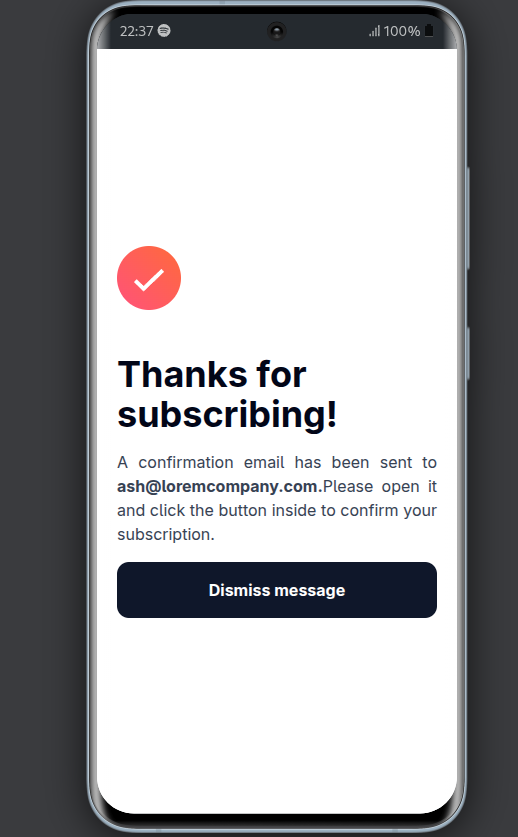

# Calculadora de Idade


## Descrição

Um formulário de inscrição para newsletter com mensagem de sucesso ou falha.

O Formulario de Inscrição para newsletter foi um desafio do Frontend Mentor. O desafio consistiu em criar um formulário de inscrição para newsletter com validação de dados e mensagem de sucesso ou falha.


## Tecnologias e Dependências

- React
- TypeScript
- Node.js
- Vite
- Tailwind
- Jest

## Instalação

Para instalar a Calculadora de Idade, siga os passos abaixo:

1. Clone o repositório:

```bash
git clone https://github.com/kevenklynsman/newsletter-frontendMentor.git
```

2. Instale as dependências:

```bash
cd newsletter-frontendMentor
npm install
```

3. Inicie a aplicação:

```bash
npm start
```     

## Pré-requisitos

- vscode
- Node.js
- NPM

## Imagens

<p align="center">
  
  
  
  
  
</p>


## Contato 

- GitHub: [kevenklynsman](https://github.com/kevenklynsman)
- LinkedIn: [kevenklynsman](https://www.linkedin.com/in/kevenklynsman/)
- E-mail: [kevenklynsman2003@gmail.com](mailto:kevenklynsman2003@gmailcom)